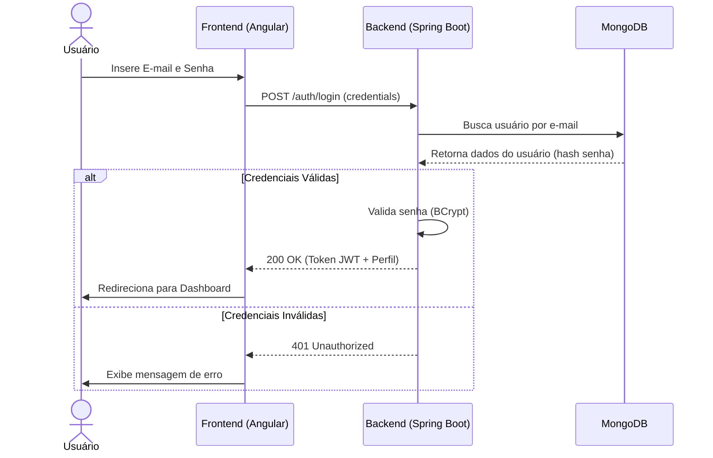
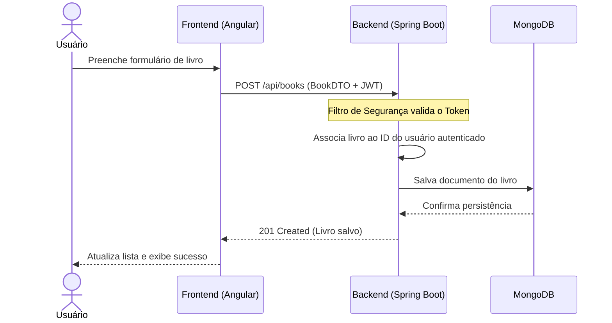
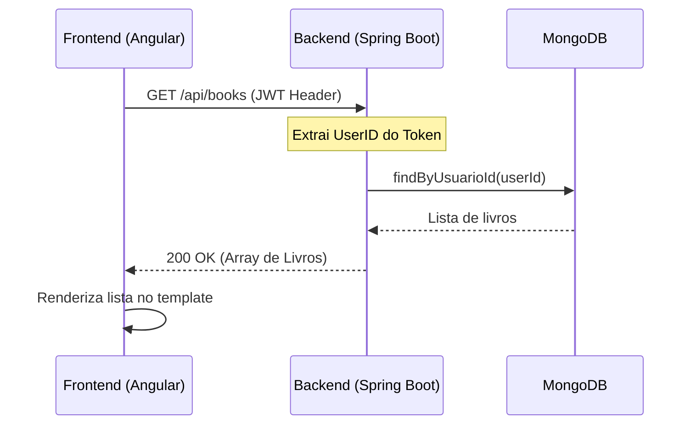

# 📊 Diagramas UML de Sequência

Este documento contém os diagramas de sequência que descrevem o fluxo de interação entre os componentes do sistema **Gerenciador de Biblioteca Pessoal**.

---

## 1. Fluxo de Autenticação (Login)

Este diagrama descreve o processo desde a entrada das credenciais pelo usuário até o recebimento do acesso ao sistema.

---

## 2. Fluxo de Cadastro de Livro

Descreve como um novo livro é adicionado à coleção pessoal do usuário.

---

## 3. Fluxo de Listagem de Livros

Descreve a recuperação segura dos livros pertencentes a um usuário específico.

---
*Documentação gerada como parte do processo de modelagem de sistema.*
