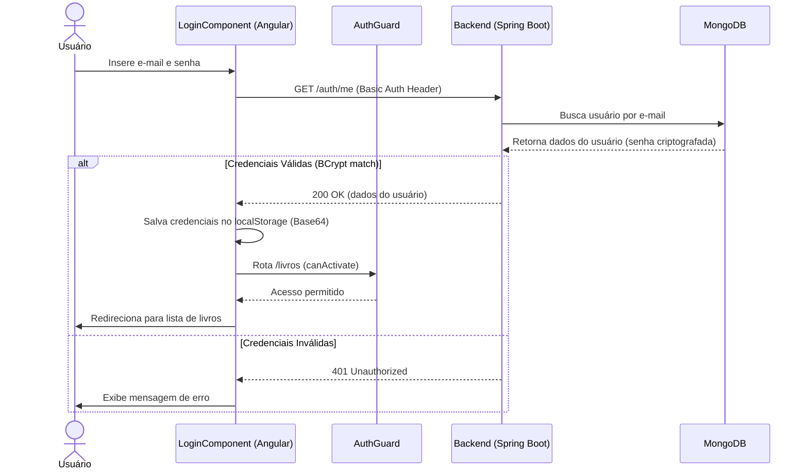
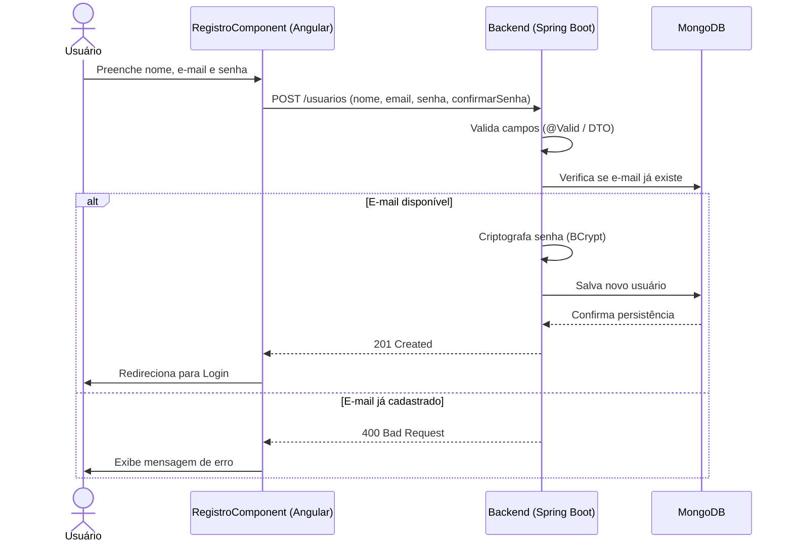
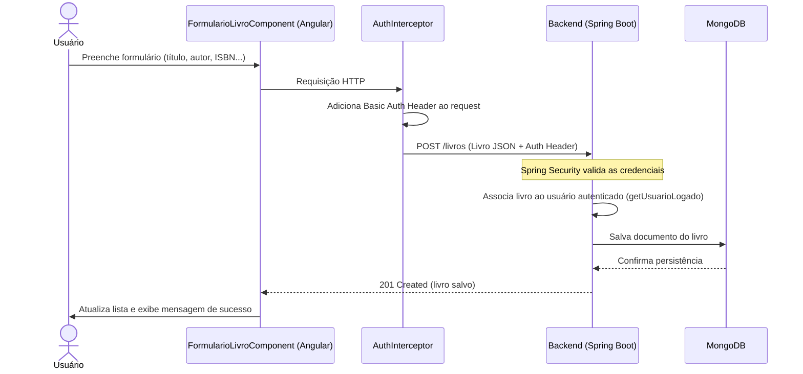
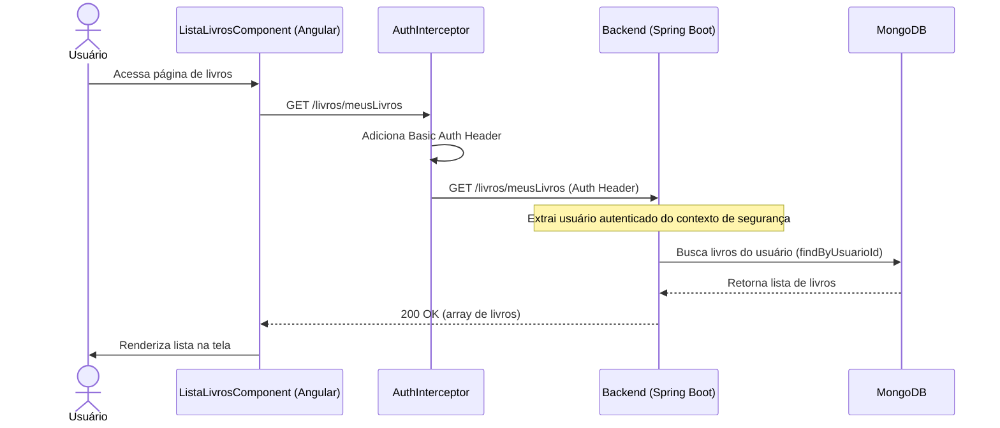
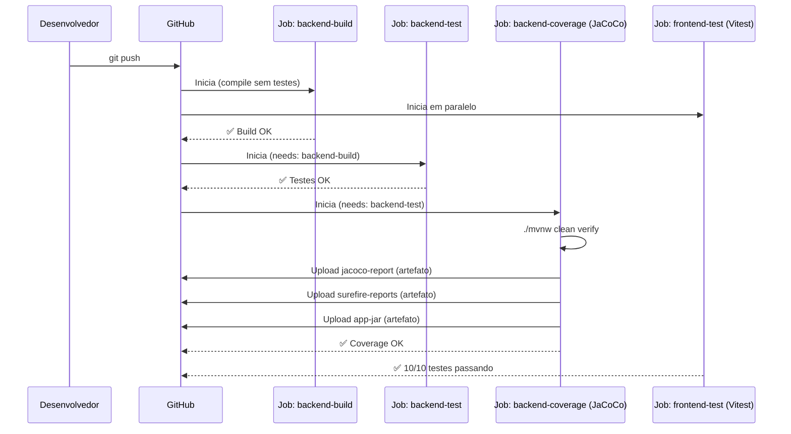
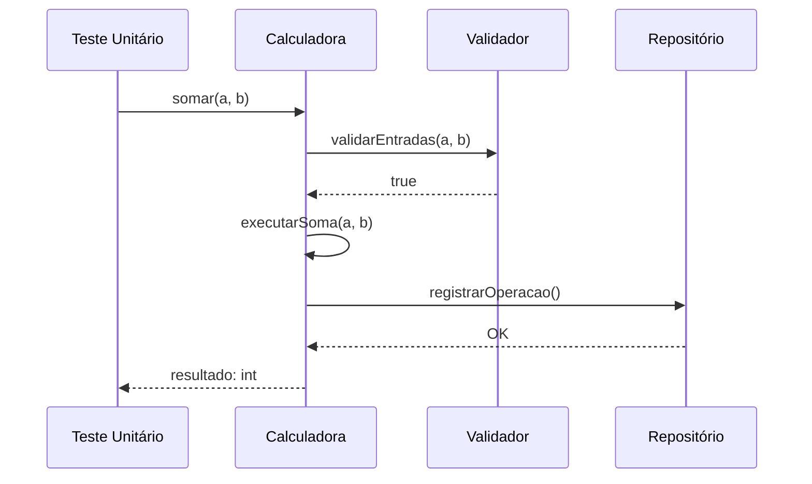
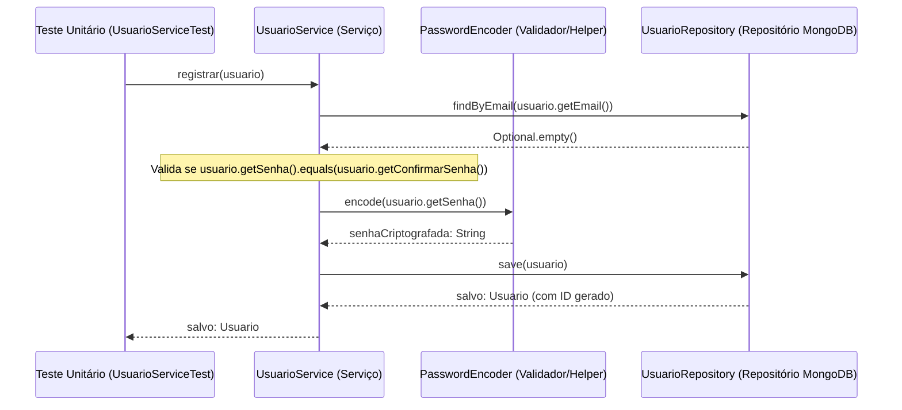

# 📊 Diagramas UML de Sequência

Este documento contém os diagramas de sequência que descrevem o fluxo de interação entre os componentes do sistema **Gerenciador de Biblioteca Pessoal**.

---

## 1. Fluxo de Autenticação (Login)

O usuário insere suas credenciais. O frontend envia uma requisição com **Basic Auth** ao backend, que valida via Spring Security e retorna o perfil do usuário.

---

## 2. Fluxo de Cadastro de Usuário (Registro)

---

## 3. Fluxo de Cadastro de Livro

Descreve como um novo livro é adicionado à coleção pessoal do usuário autenticado.

---

## 4. Fluxo de Listagem de Livros

Descreve a recuperação segura dos livros do usuário autenticado.

---

## 5. Fluxo do Pipeline de CI/CD

Descreve a sequência de execução automática do GitHub Actions a cada push.

---

## 6. Diagramas de Sequência de Teste Unitário (Modelo de Teste de Fluxo)

Esta seção apresenta o modelo de testes unitários sem mocks sob a perspectiva de diagramas de sequência.

### A) Modelo Padrão do Professor (Cenário de Referência)

Este diagrama representa a estrutura exata fornecida no modelo de referência (Calculadora/Validador/Repositório):

### B) Modelo Aplicado ao Nosso Projeto (Cenário Real: Cadastro de Usuário)

Este diagrama demonstra a aplicação prática e literal do modelo do professor no nosso projeto real de Q.A, mapeando a classe de teste exercitando as regras de negócio sem mocks e utilizando exatamente as assinaturas de métodos presentes em `UsuarioService` e `UsuarioServiceTest`:

---

*Documentação gerada como parte do processo de modelagem de sistema — Projeto Q.A, Senac 2026.*
