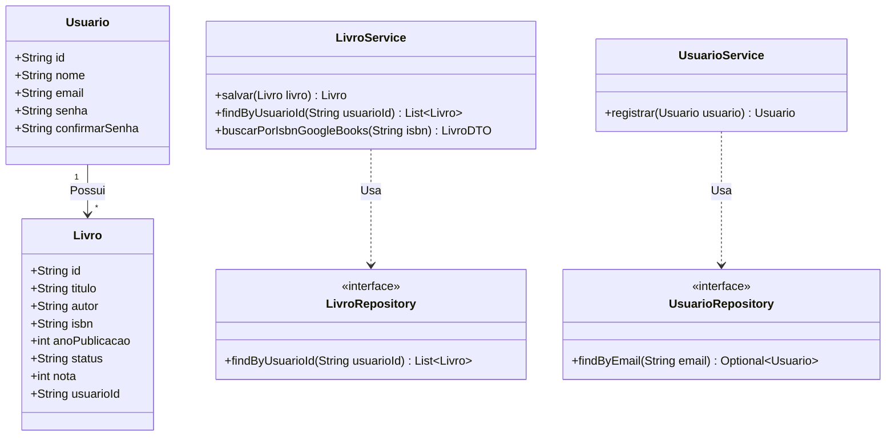
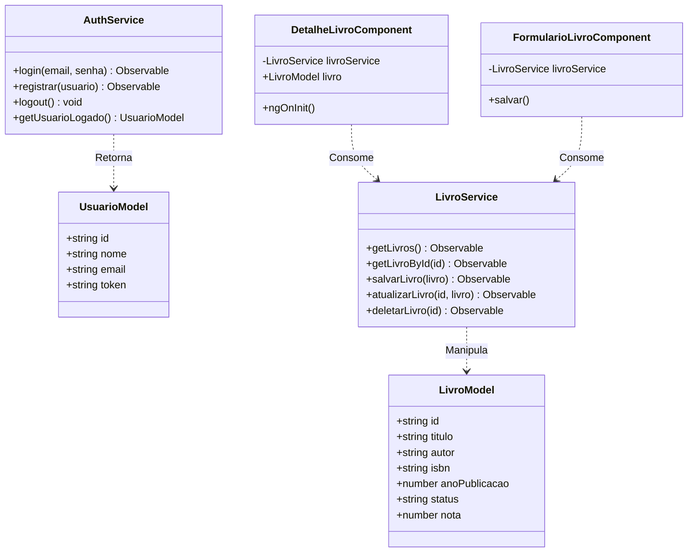
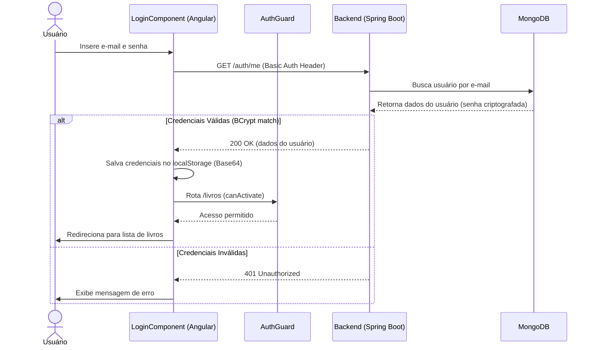
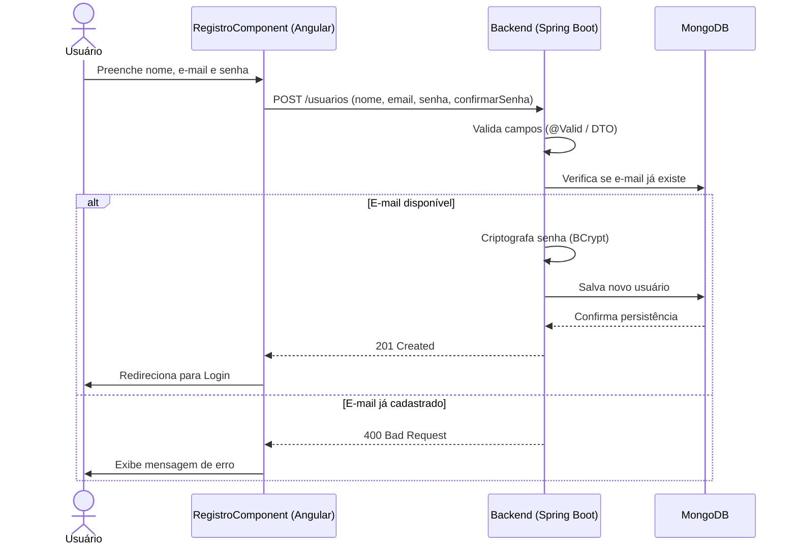
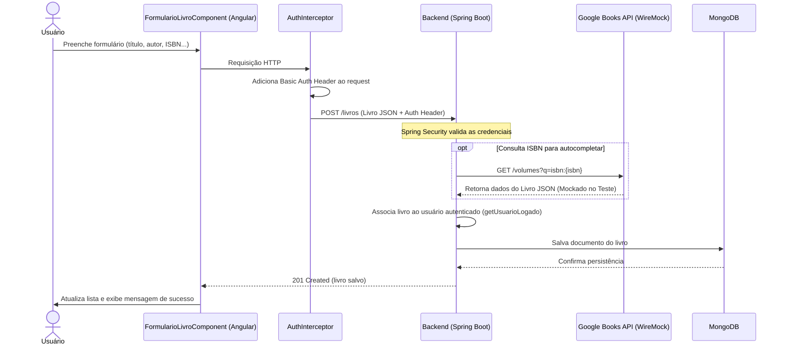
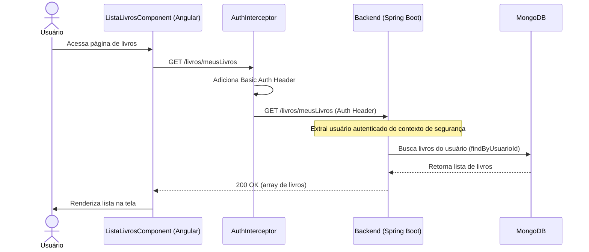
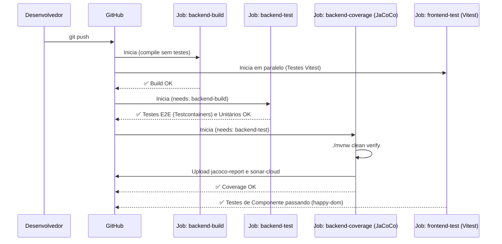

# 📊 Diagramas UML do Sistema

Este documento contém os diagramas de sequência e classes que descrevem a estrutura e o fluxo de interação entre os componentes do sistema **Gerenciador de Biblioteca Pessoal**.

---

## 1. Diagramas de Classe

### A) Backend (Spring Boot)

Estrutura principal das Entidades e Relacionamentos no Backend.

### B) Frontend (Angular)

Estrutura principal de Modelos e Serviços no Frontend.

---

## 2. Diagramas de Sequência (Fluxos)

### 2.1 Fluxo de Autenticação (Login)

O usuário insere suas credenciais. O frontend envia uma requisição com **Basic Auth** ao backend, que valida via Spring Security e retorna o perfil do usuário.

### 2.2 Fluxo de Cadastro de Usuário (Registro)

### 2.3 Fluxo de Cadastro de Livro (com Wiremock/VCR)

Descreve como um novo livro é adicionado à coleção pessoal, e os testes de API integrados.

### 2.4 Fluxo de Listagem de Livros

Descreve a recuperação segura dos livros do usuário autenticado.

### 2.5 Fluxo do Pipeline de CI/CD

Descreve a sequência de execução automática do GitHub Actions a cada push.

---

*Documentação atualizada como parte do processo de modelagem de sistema — Projeto Q.A, Senac 2026.*
