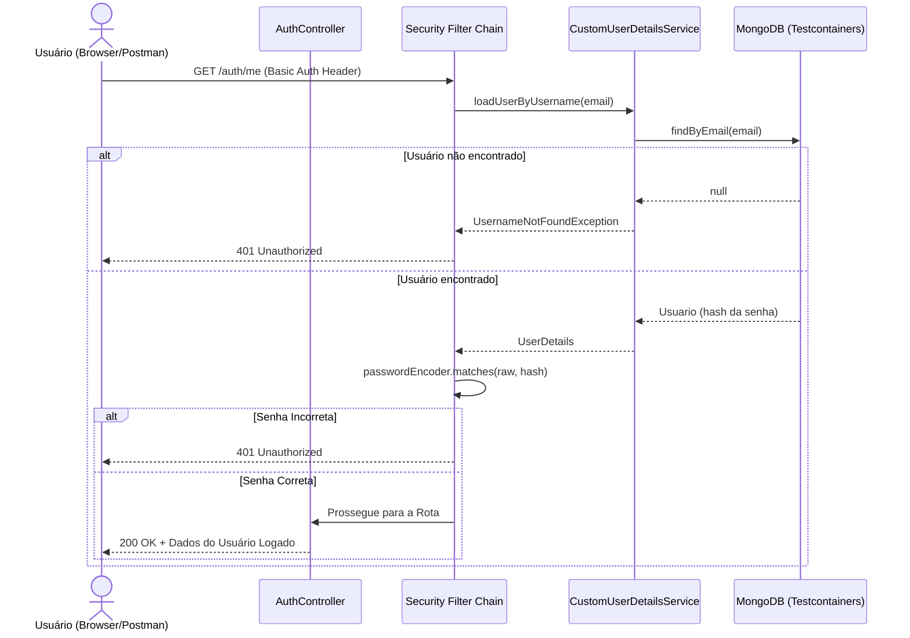
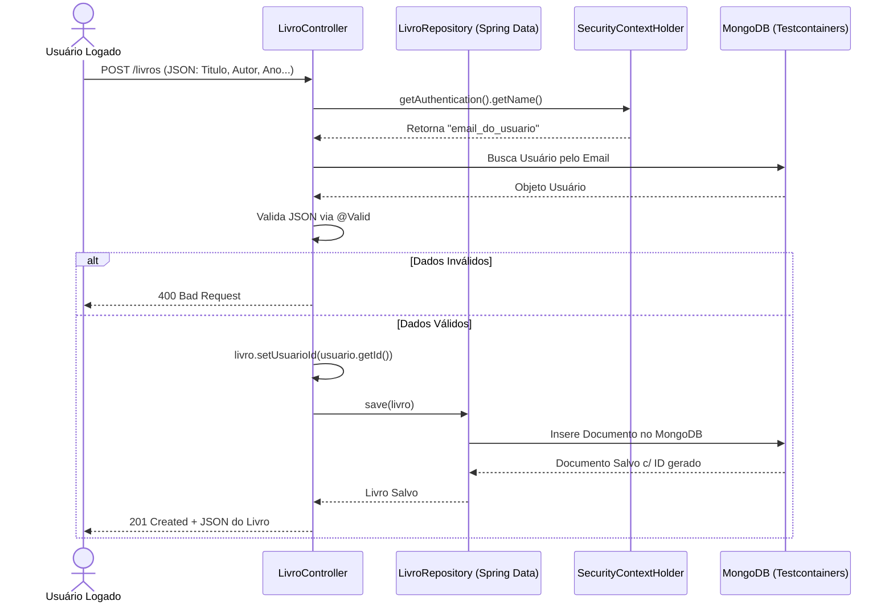

# Matriz de Rastreabilidade de Requisitos (RTM) - Projeto Gerenciador de Biblioteca

Este documento mapeia os Requisitos Funcionais do projeto para os seus respectivos testes, garantindo 100% de cobertura nos cenários avaliados, em conformidade com as regras estabelecidas para o projeto.

## Matriz de Rastreabilidade

| ID Req. | Requisito (Descrição) | Testes Associados (Classe / Método) | Cobertura | Tipo de Teste |
|---------|-----------------------|--------------------------------------|-----------|---------------|
| **RF01** | Cadastro de Usuário (O sistema deve permitir novos registros, criptografando a senha) | `UsuarioServiceTest.registrar_deveLancarExcecaoSenhasDiferentes` (Parametrizado)   `UsuarioControllerTest.createUsuario` | 100% | Unitário / E2E |
| **RF02** | Login / Autenticação (O sistema deve validar as credenciais e manter o contexto HTTP Basic Auth) | `CustomUserDetailsServiceTest.loadUserByUsername_sucesso`   `AuthControllerTest.getCurrentUser_sucesso`   `AuthControllerTest.getCurrentUser_inexistente` | 100% | Unitário / E2E |
| **RF03** | CRUD de Livros: Criação (O sistema deve permitir criar um livro) | `LivroControllerTest.createLivro_deveRetornar201QuandoValido` | 100% | E2E |
| **RF04** | CRUD de Livros: Leitura (Listagem de todos os livros do sistema) | `LivroServiceTest.findAll_deveRetornarTodosOsLivros`   `LivroControllerTest.getAllLivros_deveRetornarListaQuandoAutenticado` | 100% | Unitário / E2E |
| **RF05** | CRUD de Livros: Meus Livros (Listagem apenas dos livros do usuário logado) | `LivroServiceTest.findByUsuarioId_deveRetornarLivrosDoUsuario`   `LivroControllerTest.getMeusLivros_deveRetornarMeusLivros` | 100% | Unitário / E2E |
| **RF06** | CRUD de Livros: Atualização (Permitir alteração parcial de campos, incluindo Nota e Status) | `LivroServiceTest.updateParcial_deveAtualizarEContextualizarNoBanco`   `LivroControllerTest.updateParcial_deveAtualizar` | 100% | Unitário / E2E |
| **RF07** | CRUD de Livros: Remoção (O sistema deve permitir excluir um livro do banco MongoDB) | `LivroServiceTest.deleteById_deveRemoverDoBanco`   `LivroControllerTest.deleteLivro_deveDeletar` | 100% | Unitário / E2E |
| **RF08** | Integração com API Externa (Google Books) para autocompletar dados do Livro | `GoogleBooksServiceVCRTest.buscarPorIsbn_comWireMock` | 100% | VCR (WireMock) |

---

## Diagramas de Sequência (UML)

Abaixo estão os fluxos de operação detalhados mapeando os dois requisitos principais: Autenticação e Cadastro de Livros.

### 1. Fluxo de Autenticação (RF02)

### 2. Fluxo de Cadastro de Livro (RF03)

---

> **Nota de Validação E2E**:  
> Conforme estipulado, 0% da camada Web e do Banco de Dados estão sendo simuladas com Mocks (`Mockito`, `MockMvc` ou similares) nos testes E2E correspondentes acima. O framework levanta o Spring Boot em uma porta aleatória, realiza requisições HTTP Reais (usando a classe genérica `RestTemplate` configurada com `JdkClientHttpRequestFactory` para suportar nativamente requisições HTTP como PATCH), passa pelo `FilterChain` de Basic Auth real e consolida a alteração em um contêiner Docker real do MongoDB instanciado pelo `Testcontainers`.
